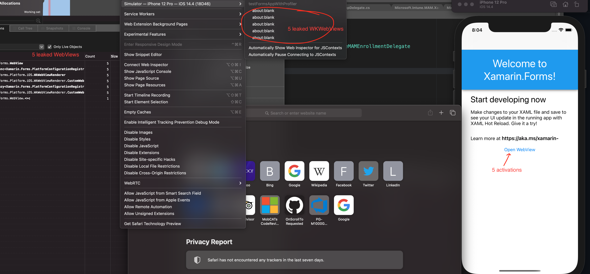

# intune-enrollment-memoryleak

This repository contains a Xamarin.iOS (Forms) application that reproduces memory leak, when WebView (and corresponding WKWebView) is retained in memory after registering a new IntuneEnrollmentDelegate

## Steps

1. Create a blank Xamarin.Forms app
1. Add the [Microsoft.Intune.MAM.Xamarin.iOS](https://www.nuget.org/packages/Microsoft.Intune.MAM.Xamarin.iOS/) package
1. Create [IntuneEnrollmentDelegate.cs](/testFormsAppWithProfiler.iOS/IntuneEnrollmentDelegate.cs)
1. Create an interface to open a WebView as many times as needed

**Actual result**: WebView and corresponding WKWebView is retained in memory, number of instances correlates with number of WebView activations
**Expected result**: WebView is garbage collected
**Workaround**: comment the `IntuneEnrollmentDelegate` class to avoid memory leak

